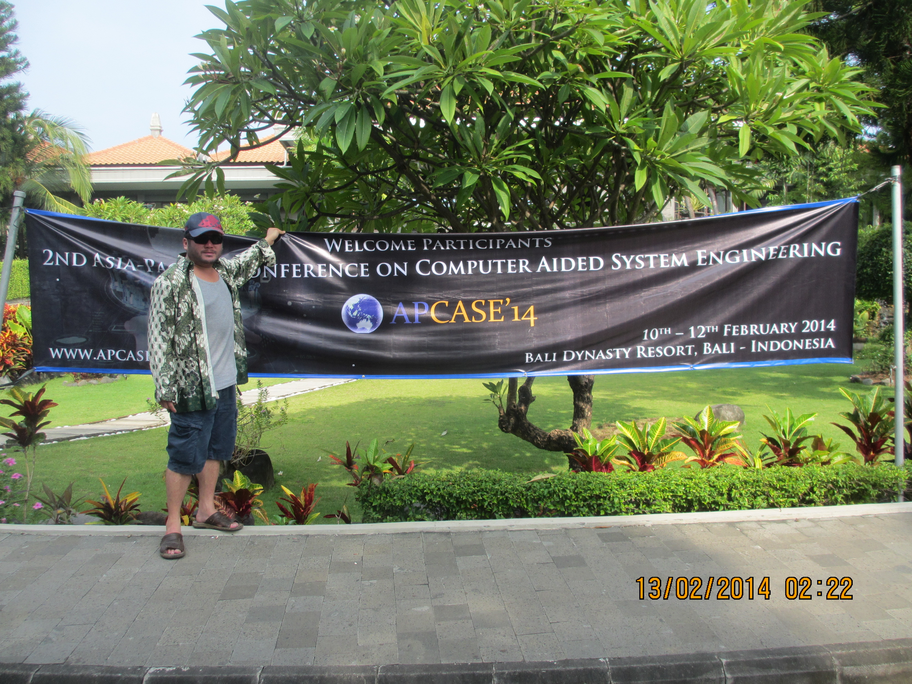

# FXTrader
Forex Trading application written in .NET using technologies like RX for pricing stream capture, WCF, WPF.

This application was developed in accordance to the "Optimizing financial markets in C# .NET" paper published in Springer Series during APCASE 2014 and plays a primary role in software engineering education.

## Demo instructions
1. Start the console WCF service FXTrader.ExternalAdapter.TcpHost
2. Start the WPF GUI Bilbos.ETrader

## Publication
This demo was developed when I was writing the paper "Optimizing financial markets in C# .NET" published in Springer Series.  I presented the publication in APCASE 2014 engineering conference focusing on engineering aspects of software education.

You can find the publication in the engineering book 'Computational Intelligence and Efficiency in Engineering Systems Publication (Chapter 27)' from this [link](https://www.springer.com/gp/book/9783319157191)

APCASE '2014 Bali, Indonesia

What a great day in sunny Bali, lots of exciting engineering seminars and met some great people!  Genetic heuristics, wearable RFID lots of cool stuff!

Zenon is one of the primary organises of engineering conferences in Asia Pacific.  The APCASE was a great success with a lot of academic debates on heuristics and also a great taste of hospitality from the Bali Dynasty Resort organises.  He is also the programme directory software engineering at University of Technology, Sydney which I have had the fortune to both study under and work for!

