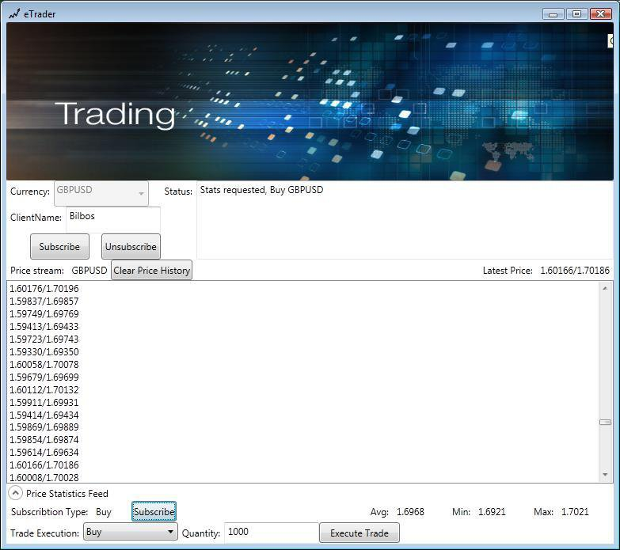

# FXTrader
Forex Trading application written in .NET using technologies like RX for pricing stream capture, WCF, WPF.

This application was developed in accordance to the "Optimizing financial markets in C# .NET" paper published in Springer Series during APCASE 2014 and plays a primary role in software engineering education.

## Demo instructions
1. Start the console WCF service FXTrader.ExternalAdapter.TcpHost
2. Start the WPF GUI Bilbos.ETrader

## Publication
This demo was developed when I was writing the paper "Optimizing financial markets in C# .NET" published in Springer Series.  I presented the publication in APCASE 2014 engineering conference focusing on engineering aspects of software education.

[Chapter 27 in Computational Intelligence and Efficiency in Engineering Systems](https://www.springer.com/gp/book/9783319157191)
